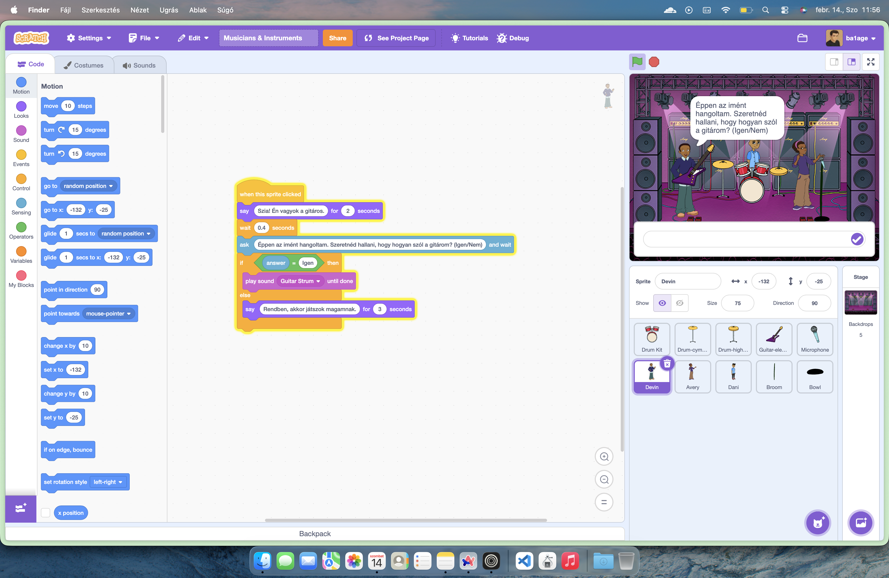

## Musicians & Instruments – interaktív zenei bemutató

Ez a dokumentáció a "Scratch projekt" feladathoz készült. A projekt célja a zene világának bemutatása, különös tekintettel a különböző hangszerekre és az emberi énekhangra egy interaktív zenekaron keresztül.

## Projektleírás

A program egy virtuális színpadot jelenít meg, ahol a felhasználó különböző zenészekkel és hangszerekkel léphet kapcsolatba. A projekt nem csupán passzív zenehallgatást tesz lehetővé, hanem a felhasználó aktivitására reagálva szólaltatja meg a különböző szólamokat.

## Szereplők

A projekt elszakad az alapértelmezett karakterektől, és három specifikus zenei szereplőt vonultat fel:
* **Énekes:** A vokális teljesítményért felelős karakter.
* **Gitáros:** A húros hangszerek hangzását mutatja be.
* **Dobos:** A ritmusszekciót jeleníti meg.

## Technikai megvalósítás

A projekt úgy készült, hogy megfeleljen a specifikus tantárgyi követelményeknek, miközben összetettebb élményt nyújt az egyszerű példáknál.

**A követelmények teljesítése:**

* **Sprite-ok használata:** A program három különálló karaktert (Sprite-ot) kezel, amelyek mindegyike egyedi kóddal rendelkezik.
* **Programozási struktúrák:**
    * **Feltételek:** A program figyeli az egérmutató pozícióját és az interakciókat (pl. érintés érzékelése, klikkelés).
    * **Ciklusok:** Bizonyos spriteok-nál (énekes) addig kérdezi a felhasználót, amíg "Igen" választ nem kap a kérdésre.
* **Multimédia:** Minden karakterhez saját hangfájlok (ének, hangszerhangok) tartoznak, amelyek a megfelelő eseményekkor szólalnak meg.

## Projektidő

***kb. 2-2.5 óra + egy egyszerű leírás, dokumentáció***

## Képernyőképek a működésről

A program futása közben a felhasználó interaktív párbeszédet folytat a szereplőkkel:

---
##### 2026 - Koós Balázs Bence - MIT License
